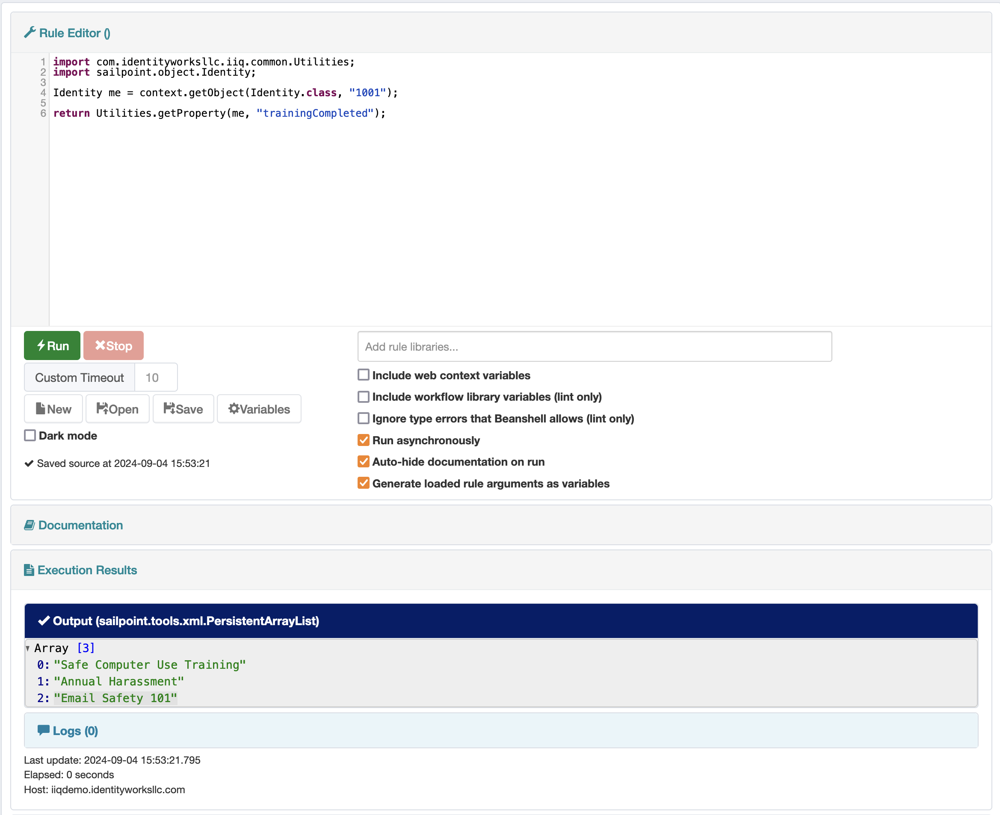
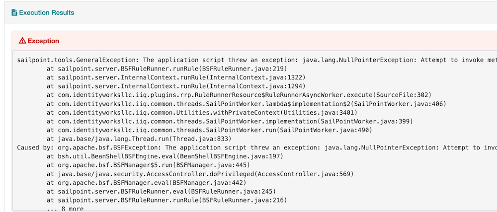
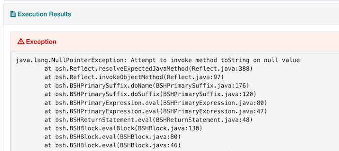
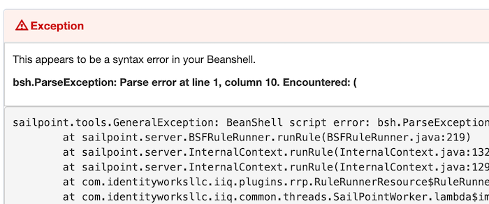
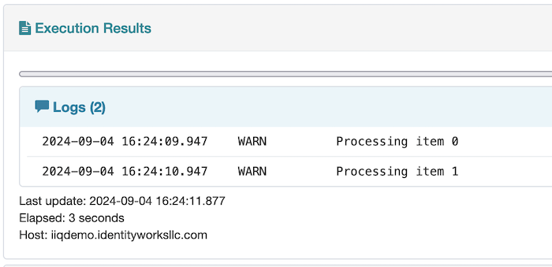
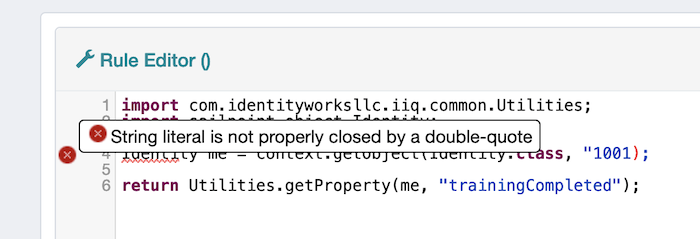
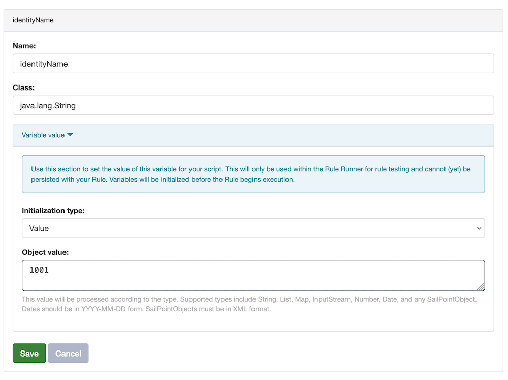
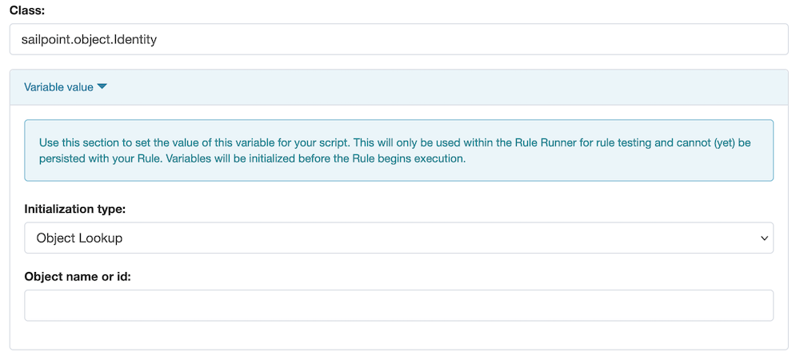

= IDW Rule Runner plugin
:toc:

**https://git.identityworksllc.com/pub/sailpoint-plugins/rule-runner-public/-/packages/155[Download the latest Rule Runner Plugin build in the Package Registry]**

NOTE: As of January 2026, this plugin requires a minimum Java version of 11. Older builds will still run in Java 8.

== Overview

The Rule Runner plugin is an in-browser IDE, allowing ad-hoc Beanshell code execution. It is similar to the Debug pages' "Run Rule" feature, but includes live syntax checking, simple auto-completion, execution history, background execution for long-running rules, many safety features.

Simply type your code into the source code box and click `Run`. The rule's output, whether success or failure, will be displayed in the _Execution results_ section. Output can be scalar, object, or XML format, or an error message, each of which render slightly differently.

NOTE: Your full script will be audited in an IIQ audit event. This may be viewable to any system administrators, depending on how logging is configured. Use Variables to inject any secrets into your script, such as when you encrypt or decrypt passwords.

If your code runs for longer than 3 seconds, execution will be shifted to a background thread, which will be polled for completion, logs, and other statistics every few seconds. You can attempt to terminate a background rule by clicking the "Stop" button.

=== Output

Most output will render as a String, usually the `toString()` of the object. Certain object types, such as List and Map, will render as a JSON tree, with each section individually collapsible (visible in the overview screenshot above).

SailPointObjects, such as Identity or Link, will be displayed as their XML equivalent.

=== Exceptions

If an exception occurs, the exception message and stack trace will be displayed in place of the output.

Beanshell (specifically, BSF) tends to swallow errors and wrap them in a less-than-useful `BSFException`. It may be useful to catch and _return_ (not throw) an exception from your rule, rather than letting Beanshell do the work for you. The Rule Runner will interpret a `Throwable` return value as an actual error and will display it as such.

[source,java]
----
try {
  somethingThatThrowsAnError();
} catch(Exception e) {
  return e;
}
----

If the error is a Beanshell parse (syntax) error, its message will be helpfully extracted and displayed above the main exception trace.

== Detailed usage documentation

=== Rule libraries

You may use Rule Library code by selecting them from the dropdown box below the source code entry area. More than one rule library can be selected.

=== Asynchronous execution

By default, the _Run asynchronously_ feature is enabled. With this feature enabled, each execution will create two background threads: (1) an execution thread to run your Rule and (2) a monitor thread.

The monitor thread is responsible for tracking the progress of the execution thread. It will attempt to terminate long-running executions after the allocated timeout period has elapsed (default: 10 minutes).

You may also terminate asynchronous execution using the _Stop_ button.

=== Logging and progress

==== Logging

Any messages logged within you Beanshell script will be updated in the browser, updated every couple seconds.

The Rule Runner injects three Beanshell variables referencing the same `Log` object: `log`, `_log`, and `__log` (with one and two underscores). This is because some Rule Libraries define their own variable called `log`, which overwrites our injected variable. You can set it back at the start of your script, like:

[source,java]
----
import org.apache.common.logging.Log;

Log log = __log;
----

==== Progress

You may also log progress messages and progress percentages using the injected `monitor` object, which implements a superset of `sailpoint.task.Monitor`. These will be reported in the user interface as a status message and a progress bar, respectively.

If the plugin option _createTaskResult_ is enabled, the TaskResult corresponding to your rule execution will be updated with the same progress values.

=== Other execution options

The following checkbox options are available:

* _Include web context variables_: If checked, the servlet variables _httpRequest_ and _httpResponse_, and the IIQ web service context _webService_ are injected to your script. This can be used to debug web session issues. Since this can only run in the context of a web service call, this option is not compatible with asynchronous execution.
* _Include workflow library variables (lint only)_: If you are writing a workflow library, the parser will assume _launcher_ and _wfcontext_ variables exist. This option provides those variables so that those lines don't cause syntax errors.
* _Ignore type errors that Beanshell allows (lint only)_: Beanshell provides a superset of Java, allowing some dynamic typing. The Java parser will reject these structures as errors or warnings. This option suppresses those errors.

=== Syntax checking

The plugin will periodically pass your script (and any included rule libraries) to a parser based on the Eclipse ECJ compiler. Errors returned by the compiler will be displayed with appropriate highlights on your screen.

Note that _the presence of error messages does not prevent you from running your script_. Beanshell can be a strange environment, and it's possible that the compiler can't make sense of a script that will run flawlessly. It's up to you, as the developer, to decide whether an error is "real" or not.

=== Variables

You can use the _Variables_ button to open the variable initialization screen. Any variables defined on this screen will be injected into your Beanshell script, allowing you to test the same Beanshell code with various inputs.

The syntax parser will assume that your variables exist with the appropriate type, so you can use them without syntax errors.

Click _Create New_ and define your variable, then click _Save_. Once finished defining variables, click _Done_.

You must specify the fully qualified Java type of each variable, such as `java.lang.String` and not just `String`.

Variables can be strings, lists, dates, or any loadable SailPointObject, such as an Identity. Variables can be initialized in various ways by selecting an "Initialization type" from the dropdown. The "Object Lookup" initialization type will become available if you enter a `sailpoint.object` class name.

== Persistence

=== Loading and saving rules

You can load, edit, and save existing Rule objects, including their source code and rule libraries.

=== Auto-save and history

The plugin uses the _localForage_ Javascript library to save the source code you are currently editing (and its metadata, such as rule libraries) to your browser's local storage. The _localForage_ library uses https://developer.mozilla.org/en-US/docs/Web/API/IndexedDB_API[IndexedDB] if it's available, but falls back to https://developer.mozilla.org/en-US/docs/Web/API/Window/localStorage[localStorage] if not.

When you execute a rule, the Rule Runner will register an IIQ audit event with the full contents of your source code and other metadata. It will also store a copy in your browser history. (If you run the same rule twice, the browser copy will be de-duplicated.)

==== Loading from audit

If you open the Rule Runner in an environment with no relevant cache on the browser side, the plugin will attempt to reconstruct your Rule Runner history from IIQ's audit events.

== Building this project

Use `./gradlew` to build the plugin and create its installable ZIP file.

=== Software required

This project uses NodeJS to compile its Typescript components. You will need to have `npm` and `npx` on your _PATH_ when you execute the build. Gradle will invoke these commands directly.
